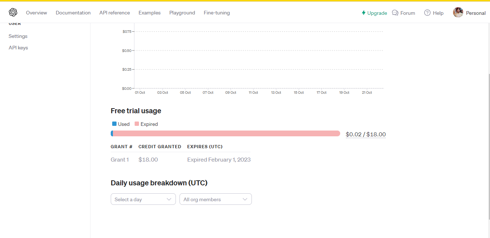

# med-gpt-bot
This is a python chat bot which used CHATGPT API to provide medical answers.

# Requirements
1. Python 3.6+
2. CHATGPT API key
3. OpenAI python library

# How to install requirements
1. Python 3.6+
    1. Install python through theri official website - https://www.python.org/downloads/
    2. pip - Python package manager will be automatically installed with python

2. CHATGPT API key
    1. Go to https://platform.openai.com/account/api-keys
    2. Sign up
    4. You will see an option to create a new API key or use an existing one
    5. Copy the API key and paste it in the python file
    6. You have to put a new API key to start using the API

3. OpenAI python library
    1. Open command prompt
    2. Type `pip install --upgrade openai`
    3. Press enter

# How to use
1. Clone the repo
2. Install requirements
3. Run the python file with script `python main.py`
4. Enter your patient's age, disease or condition or symptoms
5. Enter your question.
6. Get your answer.

Make sure you have enough credits in your OpenAI account to use the API. If you don't have enough credits, you can buy them from the OpenAI website.
